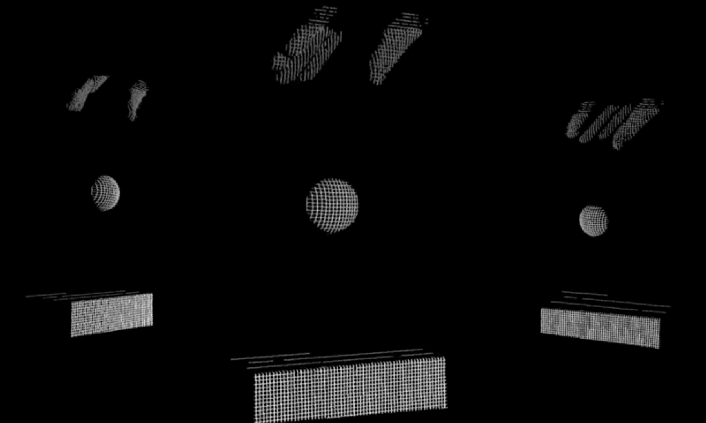
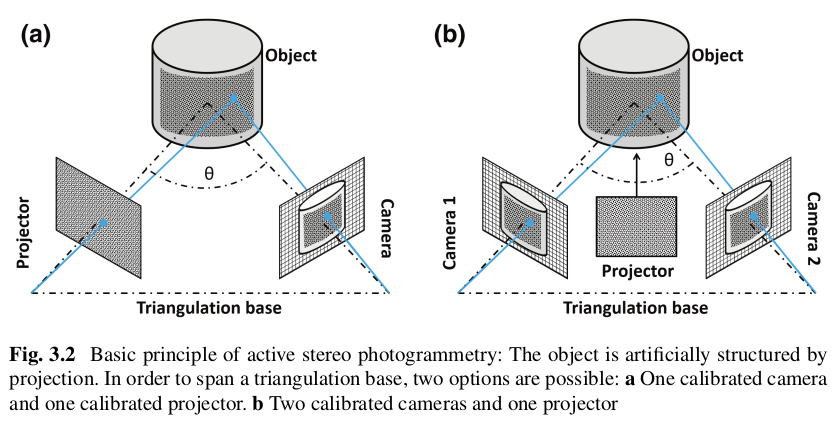
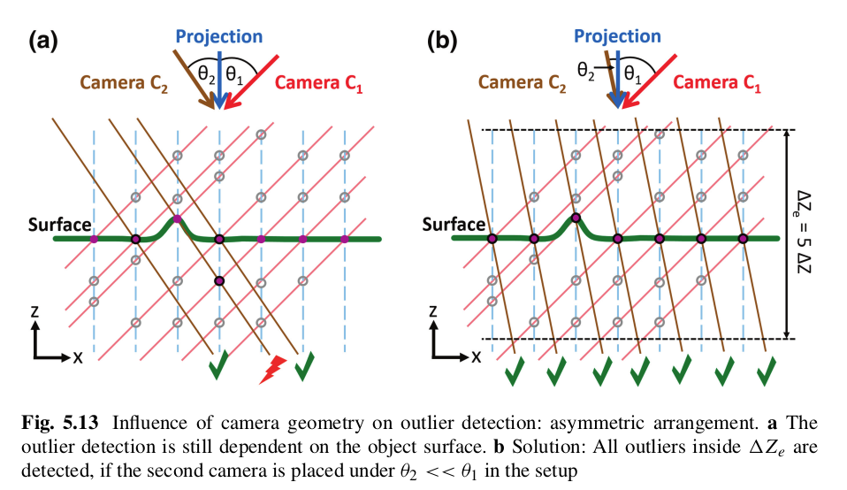
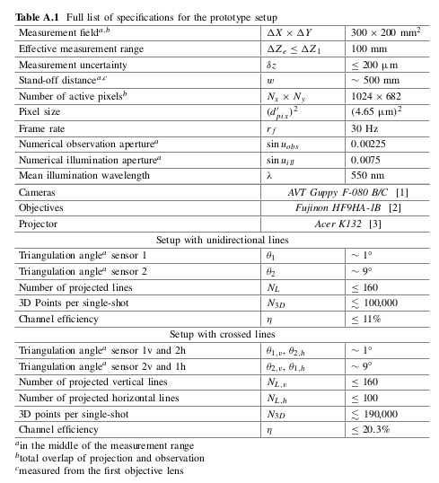
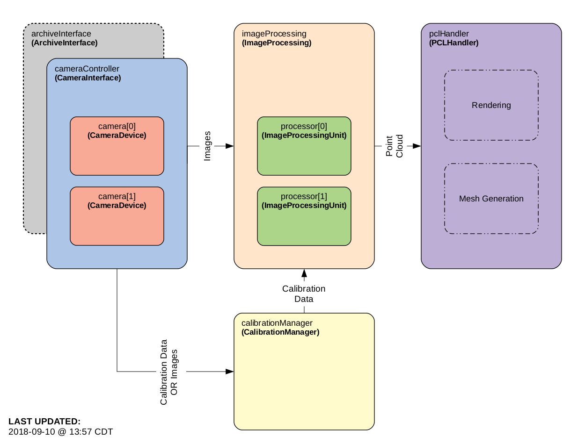
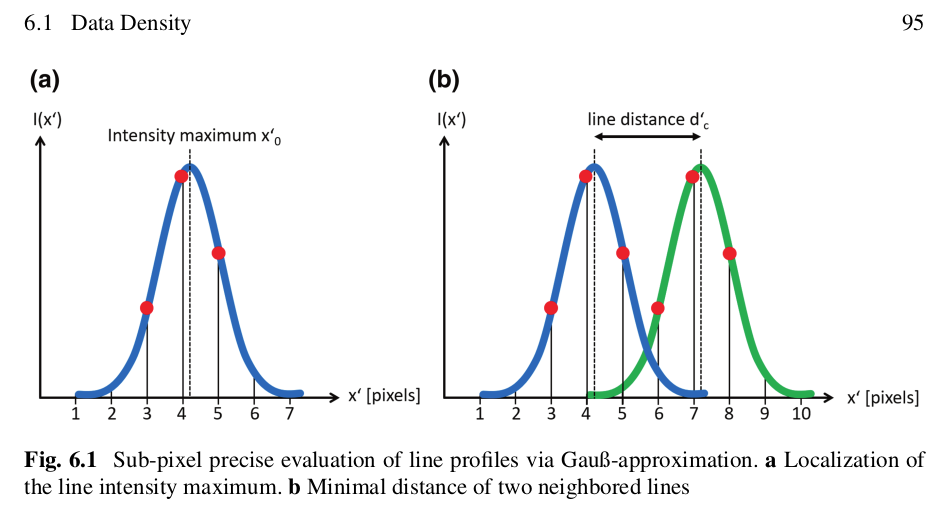
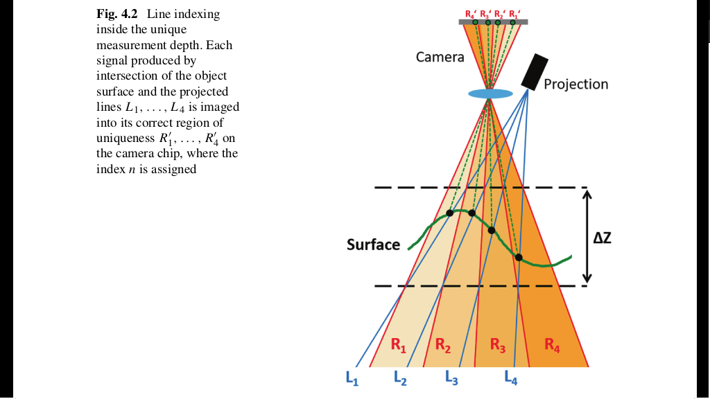
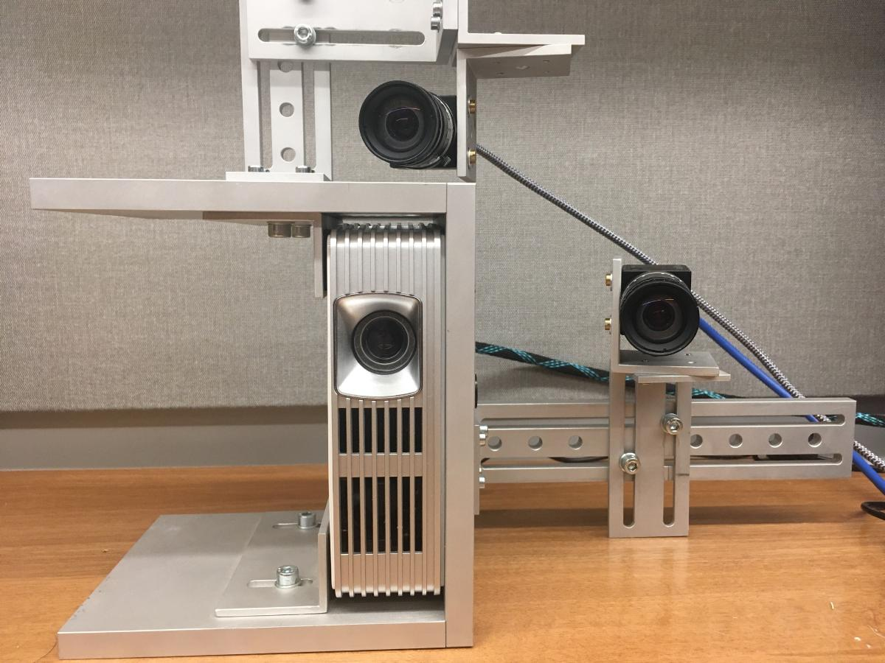
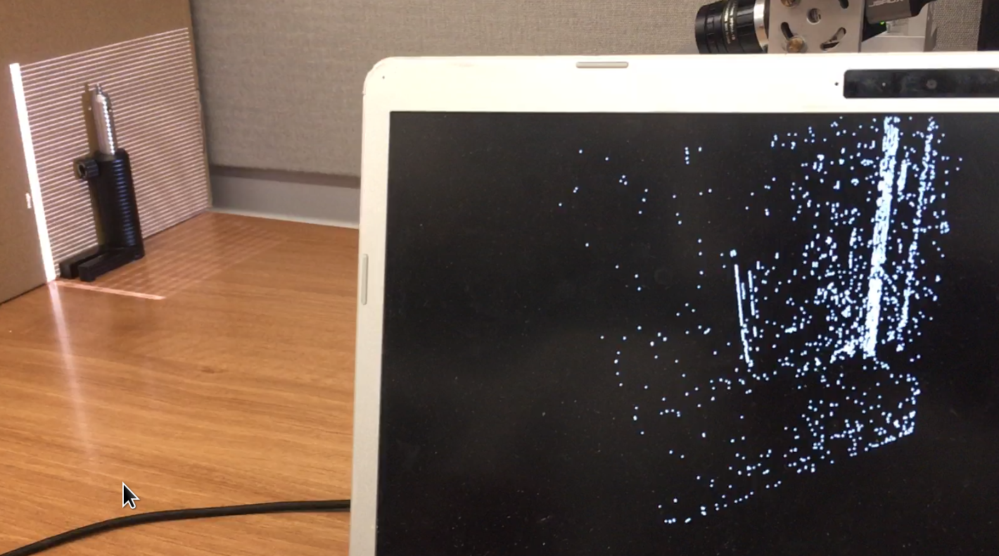
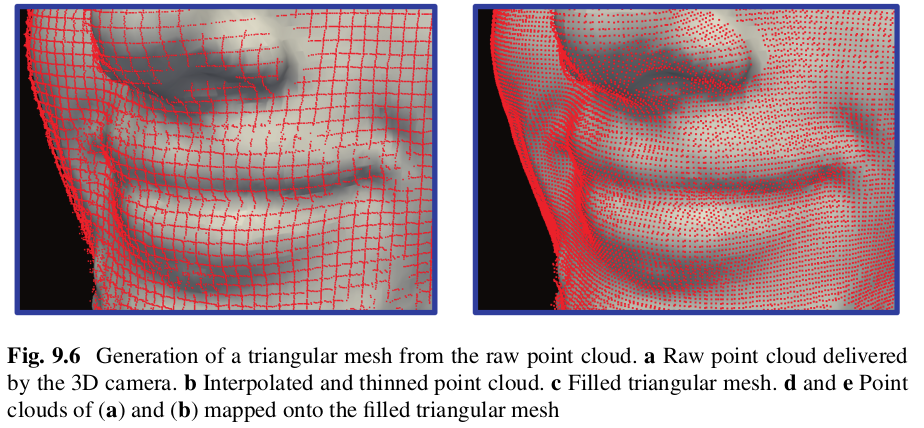

# Vikas Gupta - Portfolio
Fall 2019 Project - Computational Photography Lab, Northwestern University


[Florian Willomitzer 2017]

### Reference/Citation Note
Note: All theory discussion, images, and figures are from Florian Willomitzers Thesis *"Single-shot 3d motion picture camera with a dense point cloud"* unless otherwise stated. 

### Problem

Bring up 3D Scanning platform for real time motion capture. Using a Single Shot 3D method developed by Dr. Florian Willomitzer [Single-shot 3d motion picture camera with a dense point cloud by Willomitzer and Häusler](https://www.osapublishing.org/oe/abstract.cfm?uri=oe-25-19-23451)

How can a 3D scanning system optimize for the following? 
* Optical setup
* Minimal raw images
* High density of indepedent 3D points
* Low noise
* Proper source encoding


[Willomitzer 2017]

### Background

The single-shot 3D movie camera – 3D videos of fast scenes with unprecedented data quality. The information theoretical efficiency of triangulation (‘structured light’) systems is limited by the ‘ambiguity problem’. The concept of the ‘single shot 3D movie camera’ solves the ambiguity problem without relying on spatial or temporal codification of the projected signals. The camera sensors deliver 300,000 independent 3D points with high resolution from each 1 Mpix camera frame. A 3D sensor with these features allows for a continuous 3D measurement of fast moving or deforming objects, resulting in a continuous 3D movie. Like a hologram, each movie-frame encompasses the full 3D information about the object surface, and the observation perspective can be varied while watching the 3D movie (see related videos). 

Willomitzer's thesis work solves the correspondence of triangulation principle that aims for a high data density. In general, the solution of the correspondence problem requires the additional exploitation of modalities, such as space, time, color or polarization. His solution is to use additonal perspectives (cameras) that capture the field of view within the same frame rate.



[Florian Willomitzer 2017]

This work extends Prof. Florian Willomitzters Thesis *“Single Shot 3D Sensing Close to Physical Limits”* by researching 3D physical, information, and computational limits of single-shot 3D sensing

### Baseline Specifications


[Florian Willomitzter  2017]

### Requirements
* Real-time processing of images from the aforementioned cameras (or offline data sources)
* Generation of a dense, colorized point cloud
* Real-time rendering of generated point cloud 


### Architecture

[William Spies 2018]

The overall architecture and code was designed by William Spies, 2018 with some refactoring by Vikas Gupta to simplify the workflow. 
* archiveDevice - emulate camera device with data i/o
* archiveInterface - data i/o
* calibration - parse and handle camera calibration data
* cameraDevice - handle a camera device
* cameraInterface -  interface to handle N cameras
* scanProcessing- manage image processing units (IPUs)
* scanProcessorUnit - managers IPUs - each as a thread
* scanGenerator - processes image information, generate point cloud
* main - set controllable values, set line projection, set capture mode (precaptured data or camera)


### Camera Calibration

*Instrinsics*
The (separate) internal calibration of both cameras yields the following major results:
* Exact location of all rays of sight in space.
* Exact (three dimensional) position in space of all calibration plate markers.
The calibration is performed with the photogrammetry software Australis

```
/*Instrinsics*/
fx, fy, cx, cy, s;  // OpenCV camera matrix parameters
C, xP, yP; // Australis camera interior orientation parameters
k1, k2, k3; // Common radial distortion parameters
p1, p2; // Common tangential distortion parameters
b1, b2; // Affine non-orthogonality parameters
pix_height, pix_width; // Sensor pixel dimensions
cap_height, cap_width; // Capture region dimensions

/*Extrinsics*/
rotation; // Rotation matrix
translation; // Translation vector

```
### 
Overall these components together project line patterns via a projector, captured images from camera(s), manipulate and process the images to recover line information, and process this for baseline/triangulation of depth information , and generate a real time point cloud that can be manipulated in real time. 


### Processing

**Line Processing**



[Willomitzter 2017]

The line intensity maximum is determined by Gauß approximation.

1. Separation of line directions in the Fourier domain shown for the images of both cameras.
a Original image. 
2. 2D Fourier transformation, and apply a masking window. 
3. 2D Fourier back transformation of the masked fourier spectrum. 
4. Masked fourier spectrum is applied on to the original image

These images are used in the following steps for the evaluation of the sub pixel precise Gauß line maxima.



[Willomitzter 2017]


**Indexing and Evaluation of the ‘Coarse’ 3D Model**
One full line profile (4–6 pix width) is located. The lateral
positions of the borders are obtained from the mask of Fig. 8.7d. Figure 8.8a visualizes
These positions are not assigned to a line index n so far. 
The assignment requires the regions of uniqueness.
Each region represents a different line index n. The index n is assigned to the corresponding sub pixel precise line maximum x for each pixel-row y  . Eventually the space coordinates (x, y, z) are calculated . This yields a "course" 3D model. 
.

**Index Back Projection and Evaluation of the Final**
The ‘coarse’ 3D model is back projected line-wise onto the chip of the other camera. The back projection is performed by the inverse operation in [Willomitzer 17] 8.3 . Coordinates are projected through the optical center (distance c) to obtain the lateral coordinates in space. Each back projected line is assigned to a certain line index n.
Eventually, a line index is assigned to each Gauß maximum.
The back projection with the smallest distance to each maximum defines its index n. 


### Tools
* C++
* PCL
* Eigen
* Industrial Cameras  (ie PointGrey)
* Spinnaker API (PointGrey)
* Projector


### Work
* Collaborated with CPL team
* Brought up original Project / Camera Platform / Harness from Germany for real time processing
* Bring up new PointGrey Camera
* Render 3D uncalibrated point cloud in real time with 2 Camera setup
* Migrate development and environment from laptop a higher powered machine (from Intel i5 to i9 machine - unfortunately the codebase isn't using GPUs)



[Vikas Gupta 2019]



[Vikas Gupta 2019]

### Results
* Re-boot of c++ code with original hardware in progress. Two main issues include
- Image processing lag on developlement laptop. *Solution:* migrate development platform to work station. This is in progress
- Cameras require calibration. This is outstanding due to previous issues with camera firmware and workstation setup. Once this is complete, 3D point cloud processing including outlier detection should improve. 
* [Github](https://github.com/vnmr/orthrus)
<iframe width="560" height="315" src="https://www.youtube.com/embed/hGymxMiUHNA" frameborder="0" allow="accelerometer; autoplay; encrypted-media; gyroscope; picture-in-picture" allowfullscreen></iframe>

### Next Steps

[Willomitzer 2017]

* Fix Cameras interface issue on new server
* Calibrate Cameras 

### Future Work 
*See thesis for details*
* Extended Nonius-Method 
* Higher Pattern Frequencies with rotated cameras
* Variation of Pattern Period
* Move image processing to GPUs

### Acknowledgements
* **Lead** Vikas Gupta
* **Advisors** Dr.Florian Willomitzer

Computational Photography Lab, Northwestern University
