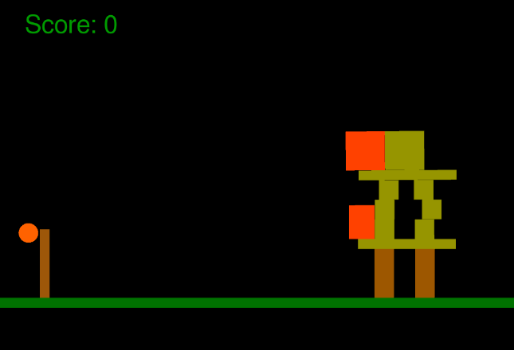
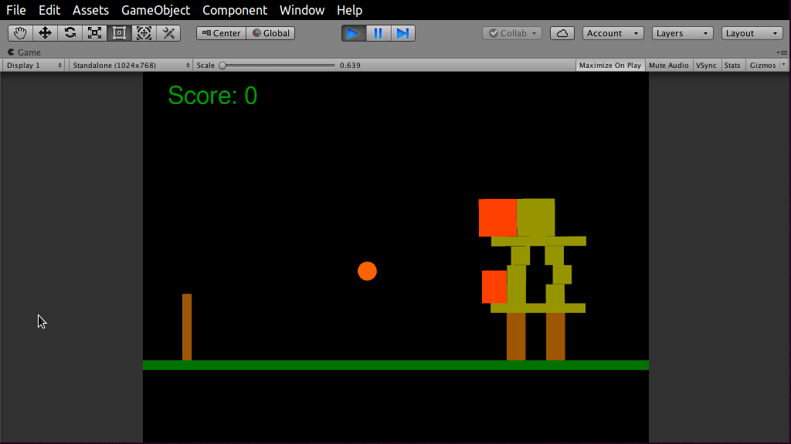
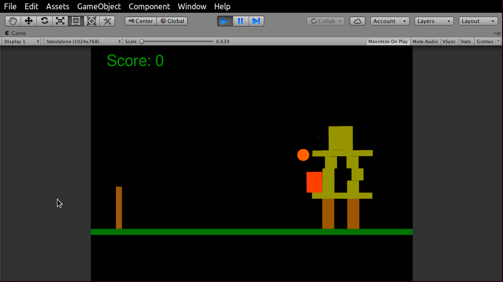
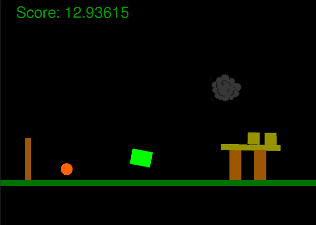

pardon the dust 🐺 updating images...

# Summary
sensing, planning, learning, control, modeling

# Publications

### 3D Human Pose Detection

We propose a new deep learning architecture that introduces a deep channel filter 
and skeleton joint related constraints as losses to a previous 2-stage temporal 
deep CNN network to reduce joint position and motion errors for 3D 
video human body pose estimation. Our model outperforms the previous reported best 
result from the literature based on mean per-joint position error on the Human 3.6M 
benchmark by 1%, and improves motion smoothness over the baseline architecture. 
This corresponds to a new state-of-the-art error reduction in all categories, opening opportunites to combine these methods with future 3D human pose estimators.

**Contribution: Joint constraints as losses with temporal CNNs
Generalizable state of the art results in widely accepted benchmark**

**First Author, CVPR 2020 Submission**

### 3D Shape Imaging

3D measurement of complicated surfaces with a tablet.
The introduced system allows for the three-dimensional measurement of extended 
specular surfaces with high surface normal variations. It consists only of a 
mobile handheld device (such as a Tablet) and exploits screen and front camera
for Deflectometry-based surface measurements. High quality surface measurements
are possible without the need for an offline calibration procedure. To compensate
for the small screen of a mobile device a multi-view registration technique is 
applied so that large surfaces can be densely reconstructed in their entirety. 
The mobile Deflectometry project is a first step towards a self-calibrating 
measurement procedure capable of taking 3D surface measurements in the wild 
and accessible to users with little to no technical imaging experience. 
We developed a ‘surface measurement app’ that received an overwhelming amount of
media coverage.

**Contribution: Hand Held instant 3D surface reconstruction
Co-Author, Optics Express 2019 submission**

**Press** [Science](https://science.sciencemag.org/content/363/6429/796), [NPR](https://www.sciencefriday.com/segments/clearing-up-the-art-acne-on-georgia-okeeffes-paintings/), Smithsonian Magazine etc

# Research
### HCI

A novel camera system that employs a natural Human Computer Interface.
An operator controls a wrist mounted camera with finger gestures. 
The camera gestures are detected, classified, and acted upon in real time.
The system is comprised of an embedded computer, inertial and force sensors
haptic, audio, and visual feedback components on a wearable substrate. 
Signals from sensors are processed and classified with classical signal and machine
learning techniques. I researched, invented, and developed a working prototype. 

**Contribution: Sole Inventor** [Patent](https://patents.google.com/patent/WO2015131157A1/en) **Granted**

[Youtube](https://www.youtube.com/watch?v=2Af4aUWo0HI\&feature=youtu.be\&t=28)

*Cited by: Facebook Reality Labs, Amazon, Intel, Xiaomi, IBM, CTRL-labs, Essential*

### Single Shot 3D Camera

The single-shot 3D movie camera – 3D videos of fast scenes with unprecedented 
data quality. The information theoretical efficiency of triangulation 
(‘structured light’) systems is limited by the ‘ambiguity problem’. The 
concept of the ‘single shot 3D movie camera’ solves the ambiguity problem 
without relying on spatial or temporal codification of the projected signals.
This enables the single-shot acquisition of 3D data with unprecedented 
resolution. The sensor delivers 300,000 independent 3D points with high 
resolution from each 1 Mpix camera frame. A 3D sensor with these features 
allows for a continuous 3D measurement of fast moving or deforming objects, 
resulting in a continuous 3D movie. Like a hologram, each movie-frame 
encompasses the full 3D information about the object surface, and the observation
perspective can be varied while watching the 3D movie (see related videos).

This work extends Prof. Florian Willomitzters Thesis *"Single Shot 3D 
Sensing Close to Physical Limits"* by researching 3D physical, information, 
and computational limits of single-shot 3D sensing

**Contribution: In Progress - Real time 3D Reconstruction, Algorithms**

[Youtube](https://www.youtube.com/watch?v=V6bOc3aBaHA)

### Swarm Robotics

Swarm Robotics platform with Prof. Michael Rubenstein, Northwestern
Reverse engineered pre-release SDK code/register settings for EVT Time of 
Flight sensor. Provided bug fixes and feedback to Time of Flight vendor 
Investigate and brought up space and power constrained SoC platform from micro-swarms. 

Provided feedback on sensor, SoC platform feasibility to lab for sensing, mapping, SLAM-type applications.

**Contribution: Bringup and characterization of micro swarm robotic sensing and SoC platform**

# Projects

### Robot Vision Object Detection Obstacle Avoidance

Prof. Kazuya Yoshida Space Robotics Challenge at Tohoku University, Japan, Robotics Summer School: Build vision based mobile robotic navigation system for an uncertain environment.
I developed a custom RGBD segmentation, obstacle avoidance using Intel RealSense D435, 
Robot Operating System, for control of a lego mindstorm mobile robot.
With limited time outside of the summer school curriculum, I developed a system to successfully track a goal, while avoiding obstacles in a single episode physical environment.

**Contribution: 1st attendee (any year) to develop vision based navigation
object detection, obstacle avoidance from scratch**

### Learning Fundementals Poster Session

I participated in AI Singapore held at NUS and SUTD, Singapore. This was the 1st 
summer annual summer session. I created an interactive active learning 
poster to discuss the heart of learning algorithms: backpropogation, bayesian updates, and the bellman equation. Code, math, and models. Presented at poster session.

**Contribution: Interactive Poster Session on Learning Fundamentals**

#### Mathematica & Unity3d

I developed a dynamic simulation of a hopping robot inspired by the Hyabusa2 
Micro-hopping robot for asteroid exploration. I modeled Lagrangian dynamics 
in Mathematica. 

- 2 <DoF <5 x, y, rotation on at least one axis (ie z)
- Rotational Inertia Torquer
- Impacts Torquer to Enclosure, Enclosure to Surface
- External Force Simulated torquer motor torque

I created an interactive game simulation in Unity3d. 

I'm interested to extend the dynamics and environment models to animal like quadrupeds in 
generated environments and explore use of Unity3Ds ML-Agents. 

### Various Robotics

**Vision**

IMG TBD....

ie Cube Stacking, Die reading etc

Various individual and team projects such as span path planning with RRT
vision based object tracking, segmentation,
Manipulation using ROS, Gazebo, turtlesim, Sawyer, Baxter etc.

**Simulation**

 

Turtlesim, custom Arms etc

**Manipulation**

ie Sawyer, Baxter

[Youtube](https://www.youtube.com/watch?v=bqnysqX-sqw) [Github](https://github.com/mschlafly/baxterplaysyahtzee)

### Mechatronics

 

ie PID Controlled Arm - Full electronics, Firmware, development and Tuning
