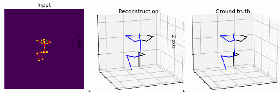
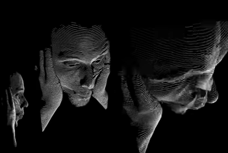
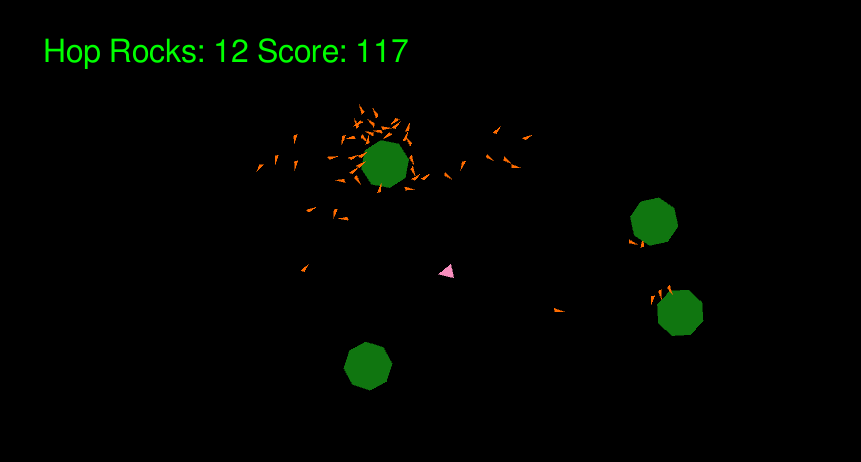
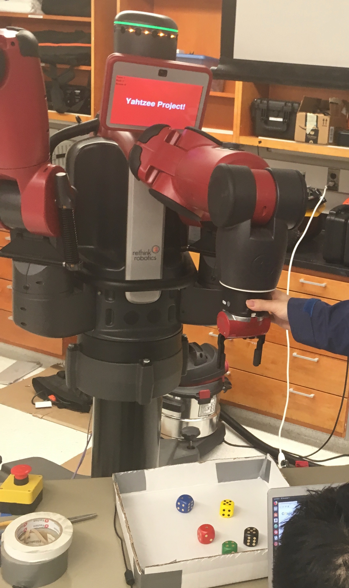
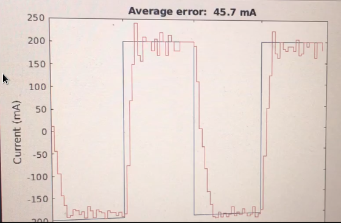

# Interests
adaptive learning agents

# Publications

### Exploring the BipedalWalker benchmark with MAP-Elites and Curiosity-driven A3C
 
source: OpenAI Gym Bipedal Walker

The MAP-Elites algorithm can efficiently explore reinforcement learning problems and optimize collections of solutions over user-defined ranges of possible behaviors. However, MAP-Elites can be difficult to scale to highly dimensional problem spaces, such as the optimization of large deep neural networks. Traditional deep reinforcement can train agents with complex network model byrelying on human-designed extrinsic rewards. In complex problems, this translates into reward landscapes that are extremely sparseand hard to explore. This has inspired the development of curiosity-driven reinforcement learning algorithms that make use of intrinsic rewards to continuously optimize for novel policies. While this approach encourage exploration, it remains to be seen whether they can be used similarly to MAP-Elites to search for a collection of highly diverse solutions.

**Contribution** First benchmark comparison of Exploration in RL with MAP-Elites+Evolutionary Algorithms. 

**Poster** First Author, GECCO 2020 *Accepted* 

**arXiv** TBD

**Code** [qdpy](https://pypi.org/project/qdpy/) open source development

**Github** TBD

### 3D Human Pose Estimation

**Contribution** Joint constraints as losses with an updated temporal CNN architecture.

### Hand-Guided Qualitative Deflectometry with a Mobile Device

3D measurement of complicated surfaces with a tablet.  The introduced system allows for the three-dimensional measurement of extended specular surfaces with high surface normal variations. It consists only of a mobile handheld device (such as a Tablet) and exploits screen and front camera for Deflectometry-based surface measurements. High quality surface measurements are possible without the need for an offline calibration procedure. To compensate for the small screen of a mobile device a multi-view registration technique is applied so that large surfaces can be densely reconstructed in their entirety.  The mobile Deflectometry project is a first step towards a self-calibrating measurement procedure capable of taking 3D surface measurements in the wild and accessible to users with little to no technical imaging experience.  We developed a ‘surface measurement app’ that received an overwhelming amount of media coverage.

**Contribution** Hand Held instant 3D surface reconstruction

**Paper** Co-Author, Optics Express 2020 *Accepted* 

**arXiv** [arXiv](https://arxiv.org/abs/1907.10700)

**Patent** Co-Author, USPTO *Pending* 

**Github** TBD

**Press** [Science](https://science.sciencemag.org/content/363/6429/796), [NPR](https://www.sciencefriday.com/segments/clearing-up-the-art-acne-on-georgia-okeeffes-paintings/), Smithsonian Magazine etc

# Research
### HCI

A novel camera system that employs a natural Human Computer Interface.
An operator controls a wrist mounted camera with finger gestures. 
The camera gestures are detected, classified, and acted upon in real time.
The system is comprised of an embedded computer, inertial and force sensors
haptic, audio, and visual feedback components on a wearable substrate. 
Signals from sensors are processed and classified with classical signal and machine
learning techniques. 

**Contribution** Research, inventor, prototyper

**Patent** First Author, USPTO *Granted* [Patent](https://patents.google.com/patent/WO2015131157A1/en) 

**Video** [Youtube](https://www.youtube.com/watch?v=2Af4aUWo0HI\&feature=youtu.be\&t=28)

*Cited by: Facebook Reality Labs, Amazon, Microsoft, Intel, Xiaomi, IBM, CTRL-labs, Essential*

### Single-shot 3D movie camera at the limit

The single-shot 3D movie camera – 3D videos of fast scenes with unprecedented 
data quality. The information theoretical efficiency of triangulation 
(‘structured light’) systems is limited by the ‘ambiguity problem’. The 
concept of the ‘single shot 3D movie camera’ solves the ambiguity problem 
without relying on spatial or temporal codification of the projected signals.
This enables the single-shot acquisition of 3D data with unprecedented 
resolution. The sensor delivers 300,000 independent 3D points with high 
resolution from each 1 Mpix camera frame. A 3D sensor with these features 
allows for a continuous 3D measurement of fast moving or deforming objects, 
resulting in a continuous 3D movie. Like a hologram, each movie-frame 
encompasses the full 3D information about the object surface, and the observation
perspective can be varied while watching the 3D movie (see related videos).

This work extends Prof. Florian Willomitzters Thesis *"Single Shot 3D 
Sensing Close to Physical Limits"* by researching 3D physical, information, 
and computational limits of single-shot 3D sensing

**Contribution** In Progress - Real time 3D Reconstruction, Algorithms

[Youtube](https://www.youtube.com/watch?v=V6bOc3aBaHA)

### Swarm Robotics

Swarm Robotics platform with Prof. Michael Rubenstein, Northwestern
Reverse engineered pre-release SDK code/register settings for EVT Time of 
Flight sensor. Provided bug fixes and feedback to Time of Flight vendor.
Investigated and brought up space and power constrained SoC platform for micro-swarms. 

Provided feedback on sensor, SoC platform feasibility to lab for sensing, mapping, SLAM-type applications.

**Contribution** Bringup and characterization of micro swarm robotic sensing and SoC platform

# Projects

### Robot Vision Object Detection Obstacle Avoidance

Prof. Kazuya Yoshida Space Robotics Challenge at Tohoku University, Japan, Robotics Summer School: Build vision based mobile robotic navigation system for an uncertain environment.
I developed a custom RGBD segmentation, obstacle avoidance using Intel RealSense D435, 
Robot Operating System, for control of a lego mindstorm mobile robot.
With limited time outside of the summer school curriculum, I developed a system to successfully track a goal, while avoiding obstacles in a single episode physical environment.

**Contribution** 1st attendee (any year) to develop vision based navigation
object detection, obstacle avoidance from scratch**

### Learning Fundementals Poster Session

I participated in AI Singapore held at NUS and SUTD, Singapore. This was the 1st 
summer annual summer session. I created an interactive learning 
poster to help network at the summer event and discuss the heart of learning algorithms: backpropogation, bayesian updates, and the bellman equation. Code, math, and models. Presented at poster session.

**Contribution** Interactive Poster Session on Learning Fundamentals

### Modeling / Simulation

***Mathematica***

I developed a dynamic simulation of a hopping robot inspired by the Hyabusa2 
Micro-hopping robot for asteroid exploration. I modeled Lagrangian dynamics 
in Mathematica. 

- 3 DoF, x,y, rotation on z
- Rotational Inertia Torquer
- Torquer Impacts Enclosure, Enclosure Impacts Surface

***Unity***

For a more dynamic environment, I created an interactive game simulation for hopping robots on asteroids with orbital gravity in Unity3d. 

I'm interested to extend the dynamics and environment models to animal like quadrupeds in 
generated environments and explore use of Unity3d's ML-Agents. 

### Robotics

***Vision***

 

I've worked on Computer Vision using hand coded image processing techniques (no Libraries), OpenCV libs in ROS (Object Detection, Tracking), and CNNs (Pose Estimation) for a variety of projects. 

[Youtube](https://www.youtube.com/watch?v=bqnysqX-sqw&feature=emb_logo)

***Simulation***

 

Gazebo Custom Arm, Turtlesim etc

***Manipulation***

 
 

Use of Sawyer and Baxter for Vision, Manipulation tasks such as playing dice. 

[Youtube](https://www.youtube.com/watch?v=vOceYSICtQc) [Github](https://github.com/mschlafly/baxterplaysyahtzee)

### Mechatronics / Control

 

ie PID Controlled Arm - Full electronics, Firmware, development and Tuning
